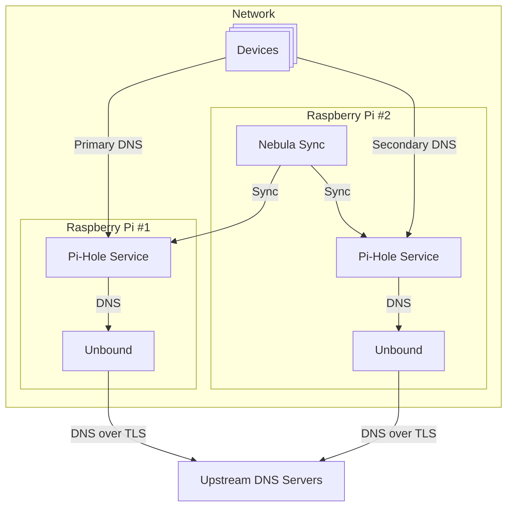

# Pi-Hole Setup

This repository contains files and instructions that I found relevant for setting up the [Pi-Hole](https://pi-hole.net/) on my network. It serves as a reference for myself and others who may be interested in setting up a Pi-Hole. It is not intended to be a comprehensive guide or tutorial.

Check out my blog posts for more deep dives into setup and configuration: <https://medium.com/@mitchell.etter>

## What is Pi-Hole?

[Pi-Hole](https://pi-hole.net/) is a network-wide ad blocker that acts as a DNS sinkhole. It intercepts DNS requests and blocks those that are known to be associated with advertising, tracking, and malicious domains. By doing so, it can improve the browsing experience by reducing the number of ads and trackers that users encounter while also enhancing privacy and security.

Please consider supporting the project by donating or contributing to its development.

## Topology

The following diagram illustrates the topology of my Pi-Hole setup on my network. Components in the diagram include:

- **Devices**: These are the various devices on the network that need to resolve DNS.
- **Raspberry Pis**: Two physical Raspberry Pi devices are used to run the Pi-Hole services and supporting services. There is a primary and secondary for redundancy.
- **Pi-Hole Service**: The main service installed on each Raspberry Pi that handles DNS requests and blocks unwanted domains.
- **Unbound**: DNS resolver that commmunicates with the upstream DNS servers.
- **Nebula Sync**: A service that synchronizes the Pi-Hole configurations between the primary and secondary Pi-Hole services.

